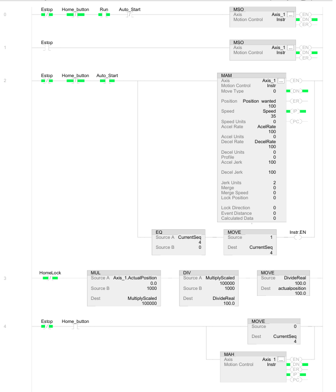
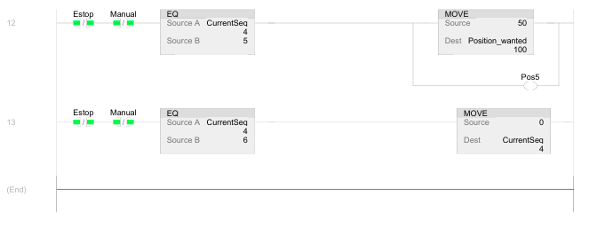

<!--
*** Thanks for checking out the Best-README-Template. If you have a suggestion
*** that would make this better, please fork the repo and create a pull request
*** or simply open an issue with the tag "enhancement".
*** Don't forget to give the project a star!
*** Thanks again! Now go create something AMAZING! :D
-->

<!-- PROJECT SHIELDS -->
<!--
*** I'm using markdown "reference style" links for readability.
*** Reference links are enclosed in brackets [ ] instead of parentheses ( ).
*** See the bottom of this document for the declaration of the reference variables
*** for contributors-url, forks-url, etc. This is an optional, concise syntax you may use.
*** https://www.markdownguide.org/basic-syntax/#reference-style-links
-->
[![Josh LinkedIn][linkedin-shield]][linkedin-url]

<!-- PROJECT LOGO -->
 

  

<h3 align="center">Mechatronics Capstone Servo Position Indexer</h3>

  

    Servo motor that oscillates around 5 different positions. Made by Cayden and Joshua Hayes for AET / Mechatronics capstone in advanced PLCs
  

<!-- TABLE OF CONTENTS -->

  
Table of Contents

  <ol>
    <li>
      <a href="#about-the-project">About The Project</a>
      <ul>
        <li><a href="#built-with">Built With</a></li>
      </ul>
    </li>
    <li>
      <a href="#Materials-Used">Materials Used</a>
    </li>
    <li><a href="#Setting-up-the-Servo">Setting up the Servo Code</a></li>
    <li><a href="#Studio5000-Code">Studio5000 Code</a></li>
    <li><a href="#HMI">HMI</a></li>
    <li><a href="#license">License</a></li>
    <li><a href="#contact">Contact</a></li>
  </ol>

<!-- ABOUT THE PROJECT -->
## About The Project

This is the documentation for the capstone project we worked on. It is an single axis position finder that goes to 5 different positions with a servo motor. Below is the code, program, hmi, and materials that we used.

(<a href="#top">back to top</a>)

### Built With

* [C.More](https://www.automationdirect.com/)
* [Studio5000](https://www.rockwellautomation.com/en-us/products/software/factorytalk/designsuite/studio-5000.html)

(<a href="#top">back to top</a>)

<!-- Materials Used -->
## Materials Used
* Motor Driver: [2198-C1004-ERS](https://literature.rockwellautomation.com/idc/groups/literature/documents/um/2198-um005_-en-p.pdf)
* Motor: [MPL-A230P-EJ72AA](https://www.rockwellautomation.com/en-us/products/details.MPL-A230P-EJ72AA.html)
* HMI: [EA9-T10-WCL](https://www.automationdirect.com/adc/shopping/catalog/hmi_(human_machine_interface)/graphical_hmi_devices/hmi_panels/ea9-t10wcl?srsltid=AfmBOoqi0IEj3LODBG-h_sAoNY-KbYAd3CgVyuxJpJt590dCL4myJ4lo)

(<a href="#top">back to top</a>)

<!-- Setting up the Servo -->
## Setting up the Servo
There is a lot to setup on a servo (Well over thousands of parameters), but here are some of the main ones.
### Setting IP
Setting up the IP to match the Servo Drive. This must be done on the physical servo controller as well, to ensure it is a static IP with no DHCP (If the router is not configured)

### Motor Plate
Online you can find motor plate catalogs to upload to studio 5000. This ensures typing errors do not happen during configuration and speeds up the time it takes to configure a servo. Alternatively you can type these parameters in from the nameplate of the motor.

### Axis Properties
Here we are configuring the axis to not be in test mode and also making sure the feedback is set motor feedback. Different motors will use different feedback whether it is an absolute encoder, or you are trying to find frequency. There are many applications and different parameters for axis properties.

(<a href="#top">back to top</a>)

<!-- Studio 5000 Code-->
## Studio 5000 Code

### Main Code
To summarize the code we are using an equal to sequencing technique. This will wait until the servo has reached a certain position, wait 5 seconds and then set the sequence equal to one above the previous step. Hence the EQ and MOVE commands. We then update the parameter in the MAM (Motion Axis Move) command to have a different destination. Here we have 5 different sequences that oscillate. 

(<a href="#top">back to top</a>)

<!-- HMI -->
## HMI

### Screen 1
This is the main servo motor control. You can see the 5 different positions it finds, lighting up green each time it reaches the next one. We then have a servo on, run, stop, and home command. These are the parameters we felt necessary in the main screen.

### Screen 2
This screen was used to change the acceleration and deceleration rate of the servo, as well as being able to set the speed %, which is the percentage of the top speed.

### Screen 3
Here is a manual mode. This is used either for testing or to find a specific position outside of the range of the servo. This is useful for maintenance technicians as they will be able to jog the servo wherever they want if they need to grease or clean certain areas. 

(<a href="#top">back to top</a>)

<!-- LICENSE -->
## License

Distributed under the MIT License. See `LICENSE.txt` for more information.

(<a href="#top">back to top</a>)

<!-- CONTACT -->
## Contact

JoshuaHayes348@gmail.com
http://linkedin.com/in/joshua-hayes21

Project Link: [https://github.com/Josh2035/Studio5000Projects](https://github.com/Josh2035/Studio5000Projects)

(<a href="#top">back to top</a>)

<!-- MARKDOWN LINKS & IMAGES -->
<!-- https://www.markdownguide.org/basic-syntax/#reference-style-links -->
[contributors-shield]: https://img.shields.io/github/contributors/github_username/repo_name.svg?style=for-the-badge
[contributors-url]: https://github.com/github_username/repo_name/graphs/contributors
[forks-shield]: https://img.shields.io/github/forks/github_username/repo_name.svg?style=for-the-badge
[forks-url]: https://github.com/github_username/repo_name/network/members
[stars-shield]: https://img.shields.io/github/stars/github_username/repo_name.svg?style=for-the-badge
[stars-url]: https://github.com/github_username/repo_name/stargazers
[issues-shield]: https://img.shields.io/github/issues/github_username/repo_name.svg?style=for-the-badge
[issues-url]: https://github.com/github_username/repo_name/issues
[license-shield]: https://img.shields.io/github/license/github_username/repo_name.svg?style=for-the-badge
[license-url]: https://github.com/github_username/repo_name/blob/master/LICENSE.txt
[linkedin-shield]: https://img.shields.io/badge/-LinkedIn-black.svg?style=for-the-badge&logo=linkedin&colorB=555
[linkedin-url]: http://linkedin.com/in/joshua-hayes21
[product-screenshot]: images/screenshot.png
